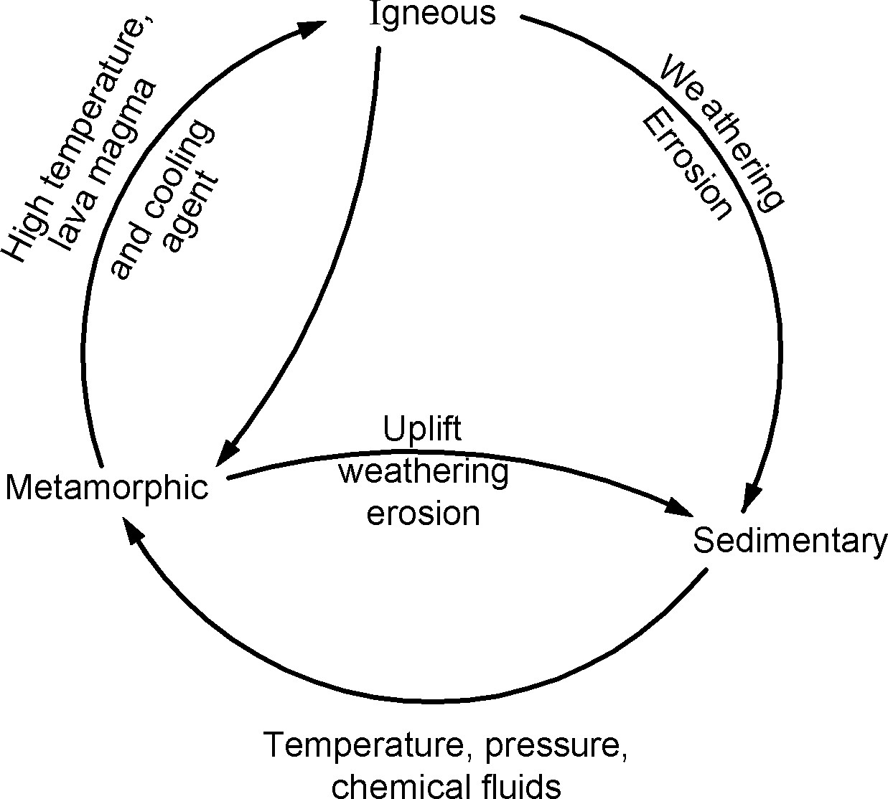
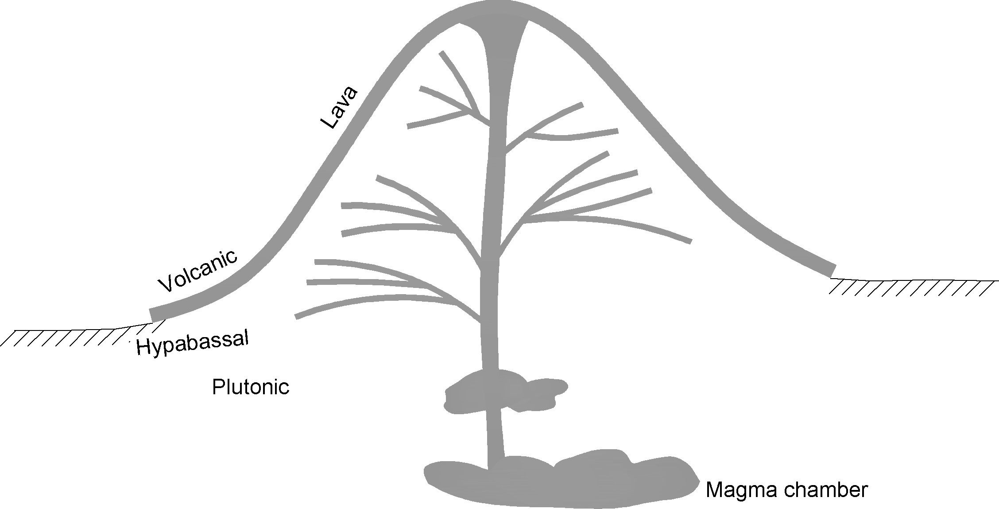
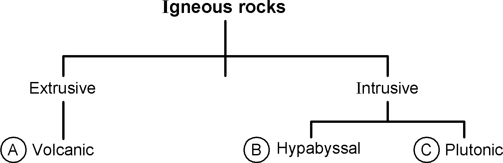
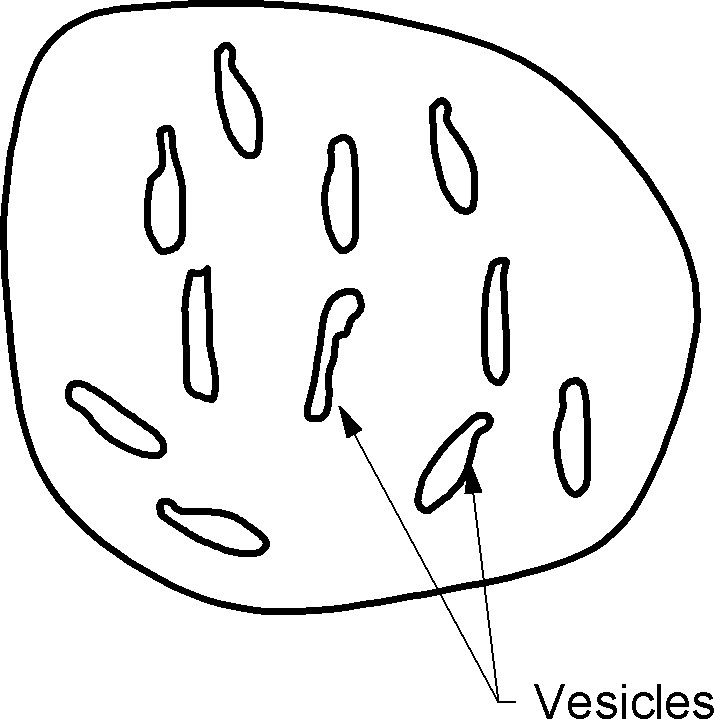
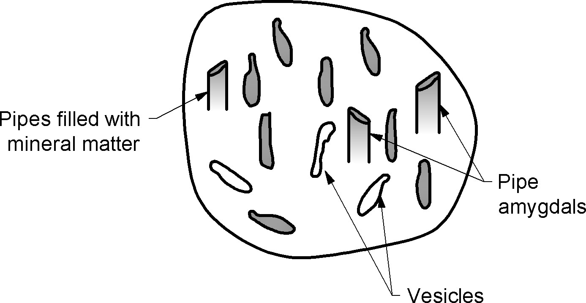

### INTRODUCTION TO PETROLOGY
- The study of rocks constitutes science of petrology. Petrology consists of a study, by all available methods of natural history of rocks including their origin, present condition and alteration decay etc.
- The term commonly used for signifying general nature of a rock is lithology, which is a description of characters of rocks observable in their hand specimens and its occurrence in nature.
- Though the same few minerals occur in rocks formed by different processes, other characters of rocks such as structures and textures depend on process of formation. 

You can find the rocks and its properties file in references which is developed by Dr. Sandeep A. Meshram, Associate Professor in Geology, COEP Technological University, Pune

### Main divisions of rocks :
In nature there exists three types of rocks: They are - 
- Igneous rocks
- Sedimentary rocks
- Metamorphic rocks

### ROCK CYCLE , BROAD CLASSIFICATION OF ROCKS
### Rock cycle 
  No rock is permanent over geologic time; instead, all rocks change slowly from one of the three rock types to another. This continuous process is called the rock cycle. The transformations from one rock type to another can follow many different paths
##### The rock cycle shows that rocks change continuously over geologic time. The arrows show paths that rocks can follow as they change 

##### The rock cycle shows relationship between three types of rocks.
- Igneous 	
- Sedimentary and 	
- Metamorphic  
	

One type of rock changes slowly to another type.
### Igneous Petrology - Plutonic, Hypabyssal and Volcanic Rocks
### Introduction 
- Cooling and consolidation of molten rock matter called magma form the igneous rocks. Magmas are formed in huge quantities in deeper parts of earth's crust by melting of crustal rock where temperature ranges from  900 - 1600&deg;C. Igneous rocks compose 90% of the earth's crust approximately.
- The igneous rocks are predominantly made up of feldspars, quartz, micas, pyroxenes and olivines etc.
- In Igneous petrology through study of lgneous rocks, which include megascopic and microscopic properties, mineral and chemical composition, genesis is carried out. 

### Classification on the basis of Occurrence -

| Extrusive rocks | |
|---| ---|
| Volcanic igneous rock | Above the surface |

| Intrusive rocks | |
|---| ---|
| Hypabyssal igneous rocks | Below the surface of the earth |
| Plutonic igneous rock	  |	Below the surface of the earth |

### Extrusive Rocks -	The rock formed due to solidification of lava i.e. on the surface is called as extrusive rocks.
The extrusive rocks are called as volcanic rocks.
- Volcanic igneous rock :
- The rocks formed on surface of the earth due to cooling of lava is called as volcanic igneous rock.
- These rocks contain fine-grained minerals e.g. of volcanic igneous rocks are Rhyolite, Syenite, Andesite and Basalt.

### Intrusive Rocks - Intrusive rocks formed when magma crystallize beneath earth’s surface. Depending on depth of formation, intrusive rocks are divided into two groups. 
- Hypabyssal rocks 
- Plutonic rocks

	
### Hypabyssal igneous rock 
- Hypabyssal igneous rocks, formed below earth surface up to the depth of 2 km.
- Minerals are medium grained i.e. coarser than volcanic and finer than those of plutonic e.g. Apatite, Dolerite.
- These rocks generally show porphyritic texture.

### Plutonic igneous rock 
- Plutonic igneous rock formed at greater depth from magma which is deeply buried in earth’s crust.
- Minerals are coarse grained e.g. Granite, Gabbro
    
### Structures of Igneous Rocks 
The physical appearance of igneous rocks, usually influenced by the process of formation results in typical structural characteristics. These structures re useful in field identification of the rocks
##### Flow Banding 
When magma reaches the surface through fissures and cracks in the subsurface sedimentary rocks, it pours out quietly as horizontal flows. When the intermittent outpouring of lava stops it rapidly cools because of the atmospheric pressure over it. After a period of quiescence, new lava from the magma chamber reaches the surface (after millions of years), and overlies the previous flow.
This phenomenon repeats itself with periods of quiescence lasting several million years. The resulting structure resembles flow bands.
##### Vesicular :
When lava reaches the surface, the atmospheric pressure acting on the 
lava is very high forcing the lava to solidify immediately. As a result cavities are formed and the gases  escape through these cavities leaving behind empty cavities called 'vesicles' Such basalts show vesicular structures that need not be interconnected.

##### Amygdales :
When the interconnected  gas cavities in vesicular basalts are filled with secondary minerals like quartz, zeolites, calcite etc. The resulting structure is called as **pipe amygdales**. The basalt in which amygdales are present is called as **amygdaloidal basalt**.

